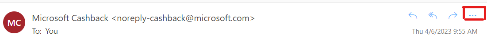
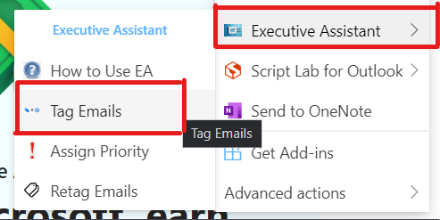
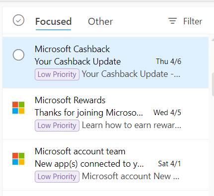
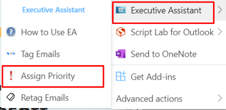
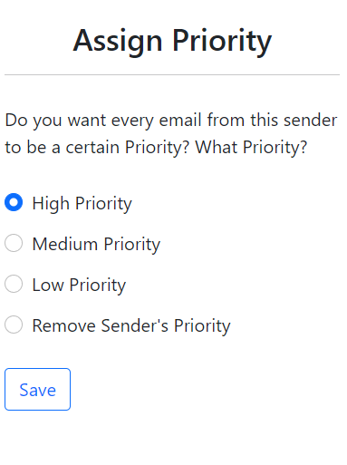
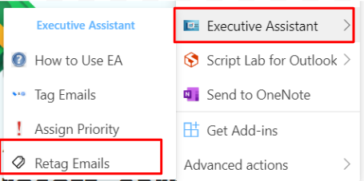
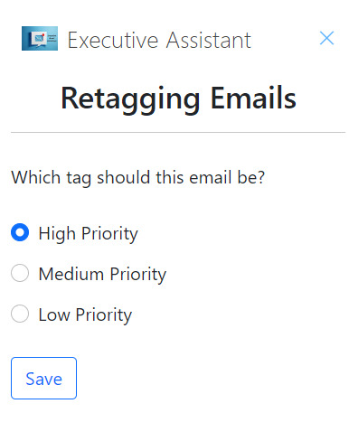

## Name
Team Executive assistant - Email classifier

## Description
This project Is the work of Team Executive asistant for the 2023 Spring capstone. It is built to take in the lastest emails in your inbox and classify them as important or not important. This was a request from a law secritary that spends at least half their working week checking and saving emails for clients and wanted a way to more easily tell what to focus their time on.

## Installation
Clone this repository to your machine. Open Outlook in your browser, In Outlook, click Get Add-ins from the Home tab on the ribbon. You can also select File > Manage Add-ins, which will take you to Outlook on the web and open the Add-Ins for Outlook dialog there.

From the Add-Ins dialog, click "my add-ins", scroll to the bottom and click the "Add a custom add in" drop down and select the "add from file" option. Naviage to locationOfClonedRepository/EA/EAManifest/ and select the EA.xml file. On the warning message click install. 

Our server currently runs on local host so to open the server open the solution at locationOfClonedRepository/EA/EA.sln in visual studio. THe click the green start arrow at the top and it should open a localhost wepage. Now you are ready to use this Email classifier

## Using the Add-on
The see and used our addon first open and email then click the 3 dots in the top right.

Once in the menu you should see section labeled with “executive assistant” which is where all our content is stored.

How to use EA 
An in-app tutorial that explains how to ues each of the other options.

Tag Emails 
This will retrieve the top emails in your inbox, use NLP to categorize how important the email is and then tag the emails with that importance. 

Dowload emails 
Downloads the top emails in your inbox to your documents folder.

Assign priority 
Allows the use to tell our add-on to ignore the NLP classification and classify all emails from that address as specified.  

Retag Emails 
If an email has been tagged incorrectly Click this option and you will be given an option to tell our NLP model what the email should have been categorized as. This will update the model for future emails. 

## Authors and acknowledgment
Sephora Bateman,
Trina Luong,
Andrew Gill,
Zachary Gundersen

